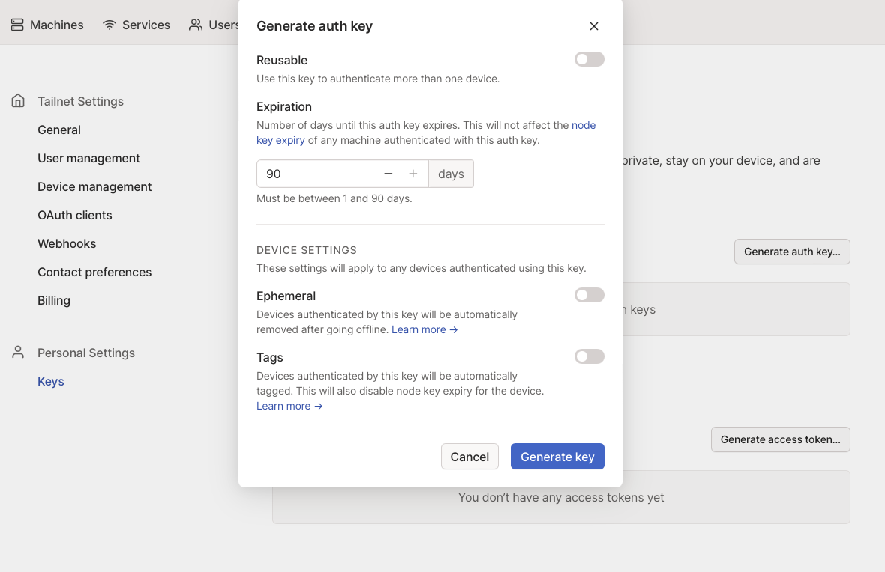

# Creating a Mariner Linux Development Machine
This will walk you through creating a Mariner Linux Hyperlight development machine using Terraform.

## Tools to install
- [Terraform](https://developer.hashicorp.com/terraform/tutorials/aws-get-started/install-cli)
- [Tailscale](https://tailscale.com/kb/installation/)
- [Azure CLI](https://learn.microsoft.com/en-us/cli/azure/install-azure-cli)

## Create an Auth Key in Tailscale
Log in to Tailscale, and go to the settings page. You should find "Keys" under the personal settings. Click on "Generate auth key...", and create a single use auth key. Copy the auth key to your clipboard for use in the next step.


## Create the Machine
```shell
terraform init
terraform plan -out main.tfplan
# you will be prompted for your tailscale auth key
terraform apply main.tfplan
```
**NOTE**: The machine will restart once at the end of the provisioning script, which is needed to ensure the mshv device is ready. It may take a couple minutes.

## Login to the Machine
With tailscale enabled on your local machine and on your Mariner VM, you should be able to log via SSH using the following command. 

If you are not able to connect right away, the machine may not have completed Tailscale registration yet. In that case, give it a minute and try again.
```shell
ssh azureuser@hyperlightdev -A
```

## Setup Your Development Environment and Run the Tests
```shell
# clone the repo
git clone --recursive git@github.com:deislabs/hyperlight.git
# setup the local env configuration
echo "export HYPERV_SHOULD_BE_PRESENT=true" > ./hyperlight/.envrc
# login to github
gh auth login
# move into the hyperlight directory (~/hyperlight)
cd hyperlight
# allow the local hyperlight env configuration bash hooks (only needed the first time)
direnv allow
# install artifacts for testing (only needed the first time)
./dev/test-guests.sh
# run the tests
just test
```

## Destroy Your Mariner Development Machine
```shell
terraform destroy
```
or
```shell
az group delete -n hyperlight-dev -y --no-wait
```

## Defaulted Variables
You can specify several variables to the Terraform plan.
- prefix: the prefix applied to the resource group name in Azure (default: hyperlight)
- vmsize: the VM size used for the machine (default: Standard_D2_v4)
- location: the Azure region which the machine is deployed (default: southcentralus)
- sshkeypath: the path to the ssh public key added to the authorized_keys file on the machine (default: ~/.ssh/id_rsa.pub)
