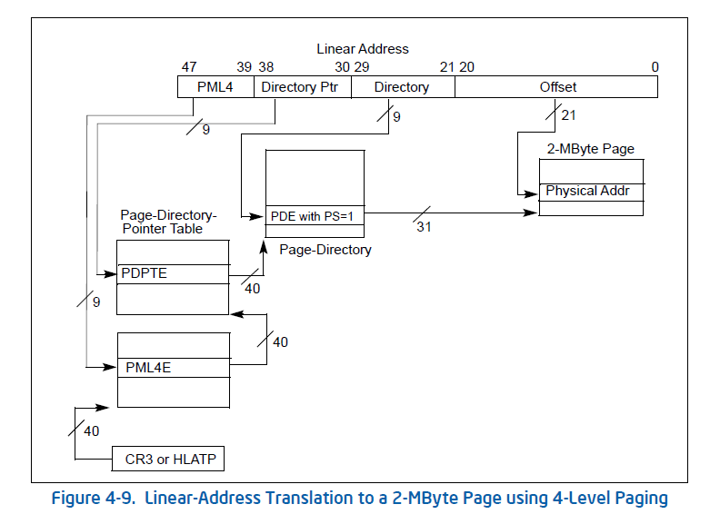

# Paging in Hyperlight
Hyperlight uses paging, which means the all addresses inside a hyperlight vm are treated as virtual addresses by the processor. Specifically, Hyperlight uses (ordinary) 4-level paging with 2MB pages. 4-level paging is used because we set the following control registers on logical cores inside a vm: `CR0.PG = 1, CR4.PAE = 1, IA32_EFER.LME = 1, and CR4.LA57 = 0`. 2MB pages is used because each PDE (Page Directory entry) in the PD (Page Directory) has flag `PS = 1`. A hyperlight vm is limited to 1GB of addressable memory, see below for more details.

## Host-to-Guest memory mapping
Into each hyperlight vm, memory from the host is mapped into the vm as physical memory. The physical memory inside the vm starts at address `0x200_000` and extends linearly to however much memory was mapped into the vm (depends on various parameters).

## Page table setup
The following page table structs are setup in memory before running a hyperlight vm

### PML4 (Page Map Level 4) Table
The PML4 table is located at physical address specified in CR3. In hyperlight we set `CR3=0x200_000`, which means the PML4 table is located at physical address `0x200_000`. The PML4 table comprises 512 64-bit entries.
In hyperlight, we only initialize the first entry (at address `0x200_000`), with value `0x201_000`(*), implying that we only have a single PDPT.

### PDPT (Page-directory-pointer table)
The first and only PDPT is located at physical address `0x201_000`. The PDPT comprises 512 64-bit entries. In hyperlight, we only initialize the first entry of the PDPT (at address `0x201_000`), with the value `0x202_000`(*), implying that we only have a single PD.

### PD (Page Directory)
The first and only PD is located at physical address `0x202_000`. The PD comprises 512 64-bit entries. We initialize each entry `i` with value `i << 21`. Thus, the first entry has value `0`, the second `0x200_000`, third `0x400_000`, fourth `0x600_000` and so on. In addition, to use 2MB pages, we set each entry's flag `PS = 1`.

## Address Translation
Given a 64-bit virtual address X, the corresponding physical address is obtained as follows:
1. PML4 table's physical address is located using CR3 (CR3 is `0x200_000`).
2. Bits 47:39 of X are used to index into PML4, giving us the address of the PDPT.
3. Bits 38:30 of X are used to index into PDPT, giving us the address of the PD.
4. Bits 29:21 of X are used to index into PD, giving us a base address of a 2MB page.
5. Bits 20:0 of X are treated as an offset.
6. The final physical address is the base address + the offset.

However, because we have only one PDPT4E and only one PDPT4E, bits 47:30 must always be zero. Moreover, because each PDE  with index `i` has value `i << 21`, the base address received in step 4 above is always just bits 29:21 of X itself. **This has the consequence that translating a virtual address to a physical address is essentially a NO-OP**.

A diagram to describe how a linear (virtual) address is translated to physical address inside a hyperlight vm:

Diagram is taken from "The Intel® 64 and IA-32 Architectures Software Developer’s Manual, Volume 3A: System Programming Guide"

### Limitations
Since we only have 1 PML4E and only 1 PDPTE, bits 47:30 of a linear address must be zero. Thus, we have only 30 bits (bit 29:0) to work with, giving us access to (1 << 30) bytes of memory (1GB).

(*) Not exactly the stated value. Can vary depending on flags.

